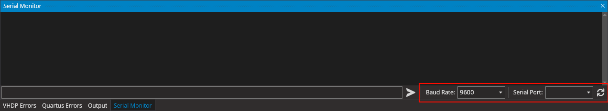

Arriving with update 0.9.2.9 the VHDPlus IDE features a built-in Serial Monitor that allows to communicate with your hardware.
<!--truncate-->

## Serial Monitor

### How to use it
1. Use `View` -> `Serial Monitor` to activate it.

2. Select Baud Rate and Serial Port. The Baud Rate should match the one you are using in your [UART Interface](#) (Documentation coming soon).

