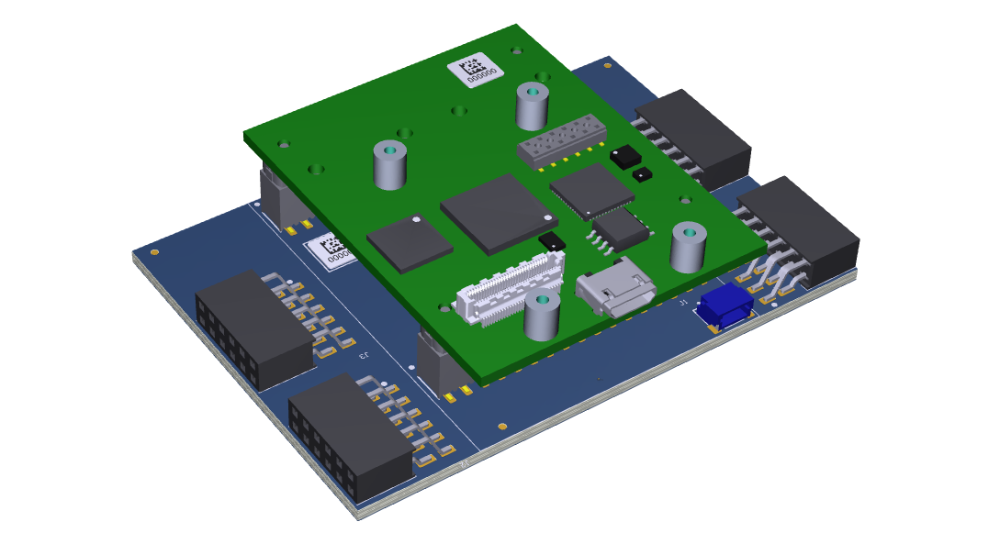
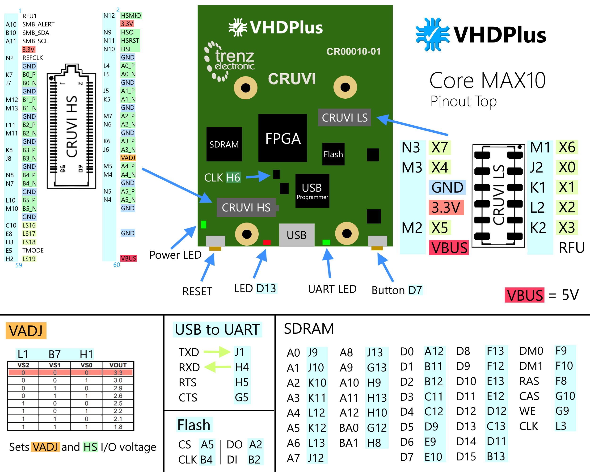

The VHDPlus Core MAX10 is the entry into FPGA programming. With it's many I/Os, internal ADC, large RAM, Flash and an onboard USB programmer, you can even realize complex projects with many components and an internal Arduino-compatible processor that work together. Also with the small form factor and Headers on the bottom, it is perfect to be used directly in your projects and with the CRUVI connectors it features a full plug and play experience. With the CRUVI High Speed connector, you can connect e.g. MIPI Camera, Gigabit Ethernet or Highspeed ADC/DAC extensions with differential I/Os to reach the full potential of the FPGA.

The MAX 10 FPGA with 8,000 logic elements can handle tasks from controlling robots to handle audio and video signals. Unlike other FPGAs, it features internal Flash and an ADC, so you can directly save your programs on the chip and don't have to use an external ADC to read analog values.

With the VHDPlus IDE you can easily program the FPGA with the onboard programmer, that also allows to send and receive data via USB.In addition the I/Os of the libraries are already defined for this board, so you can just add a library, connect the extension with the Core and program the FPGA.

## Core Overview

For your designes, the Core MAX10 has an LED and a Button that can be used. The I/Os of the ADC inputs can be used like normal I/Os. 
To use the board, plug it in with an USB cable or connect a 5V supply with the VIN and GND pin. 
With the USB programmer you can then directly program the FPGA or the internal Flash and use debug functions. 
If you add a Processor to your FPGA design, with the big external RAM and Flash, you can use and save complex programs on the board. The RAM also allows e.g. applications with cameras and object detection.

With the 2.54mm headers on the bottom, the board can be plugged in your own PCB or you can connect your development boards, you already have. These headers also have enought GND and Power pins to power them.
If you want to have the best experience with FPGA programming and don't want to waste time trying to connect the correct supply or your different components, try the VHDP Shield M with a plug and play experience. You just plug in the Core and can supply 5V or 8.5-28V with screw teminals, a DC power jack or an micro USB port. All inputs are protected and can supply the Core and all the extensions you connect. Learn more about the VHDP Shield [here](/docs/component_vhdpshield)
### Specs

    MAX 10 FPGA (10M08SAU169C8G):
        Logic Elements          - 8,000
        RAM                     - 378 Kb
        Configuration Memory    - 2.24 Mb
        ADC                     - 1 Mio. Samples/s
                                - 12 Bit
                                - 9 Inputs
        PLL                     - 2
                                - > 300 MHz
        18 x 18 Multiplier      - 24
        Configuration Images    - 2
    SDRAM (W9864G6JT-6):        - 64 Mb
    Flash (W74M64FVSSIQ):       - 64 Mb
    Oscillator (DSC6011ME2A):   - 12 MHz

### As Arduino
**IMPORTANT:** By programming in Hardware, the FPGA is much faster. This overview only compares the processor you can add to your fpga design.

| | VHDP Core | Arduino UNO | Arduino Zero |
|--|--|--|--|
| Type | 32 Bit | 8 Bit | 32 Bit |
| Frequency | 156 MHz (50 MHz default) (+ 975%) | 16 MHz | 48 MHz |
| RAM | 64.3 Mb (+ 401,873%) | 0.016 Mb | 0.256 Mb |
| Flash | 1.37 Mb (64 Mb External) | 0.25 Mb | 2.05 Mb |
| ADC | 1 MHz 12 Bit | 0.2 MHz 10 Bit | 0.35 MHz 12 Bit |

You get more speed and RAM so even image processing gets possible. Next to the processor, with the VHDP Core you can add additional parallel processes to e.g. control a motor.
