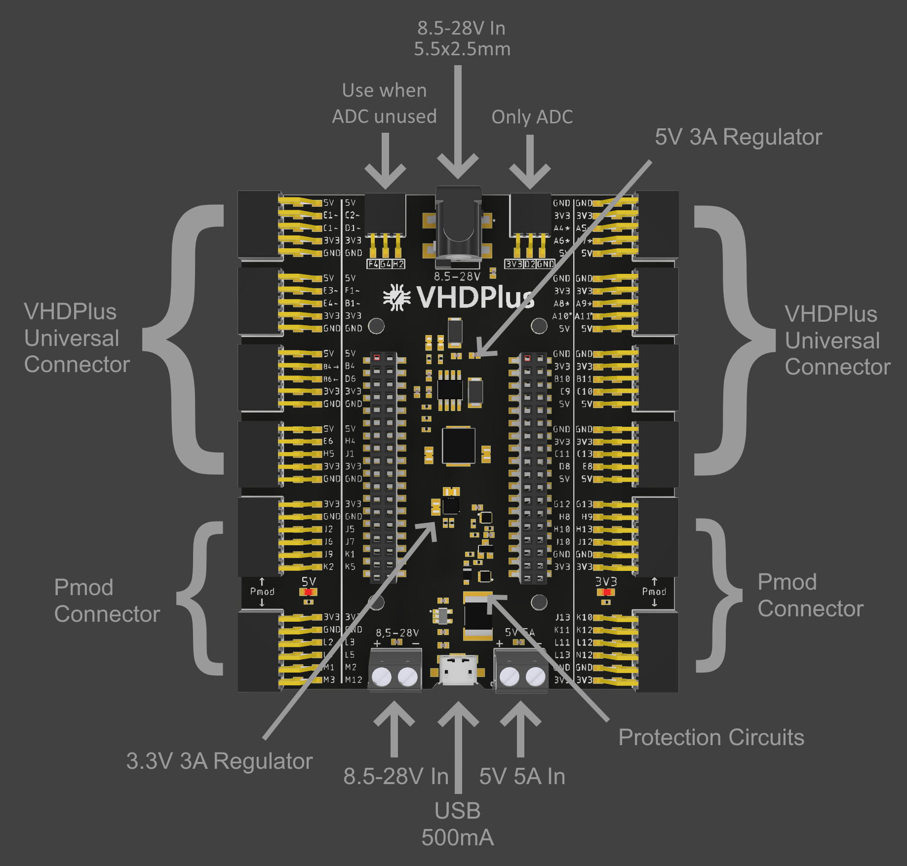

The VHDP Shield M contains a variety of protection circuits and voltage regulators to make it as easy as possible to supply all your components with power. 
With the Shield you can use all the VHDP Extensions and enjoy a plug and play experience. Don't struggle with multiple jumper cables and breadboards to connect all your devices. Just connect them with the shield and install it directly in your project instead of designing a custom pcb or having a messy construction that is held together with thousands of cables.

## Shield Overview

You have the choise of connecting the 5V or 8.5-28V directly with the screw terminals. Alternatively, connect e.g. a 12V power supply with a 5.5 x 2.5mm connector or use a micro USB cable.
For any extensions from ADC to WiFi, the micro USB connector is enough and perfect to supply the FPGA while programming. The current is limited to 500mA and the USB connector cannot output power.
The DC Power Jack and the 8.5-28V screw terminal can be used to output 5V with 3A continously. The voltage regulator even supports up to 5A. This supply also is enough to supply servo motors and if you connect a power supply with the power jack, you can use the screw terminal to supply your motors with the supply voltage (8.5-28V).
The 5V screw terminal is protected against reverse polarity, overvoltage and short circuits. It can supply up to 5A that is even enough to connect multiple servo motors directly to the 5V output.
A 3.3V voltage regulator convertes the 5V and can supply all 3.3V devices.

To use 5V devices like an ultrasonic distance sensor, check out our [level shifter](/docs/extension_levelshifter) that makes a 2x5 connector 5V compatible.