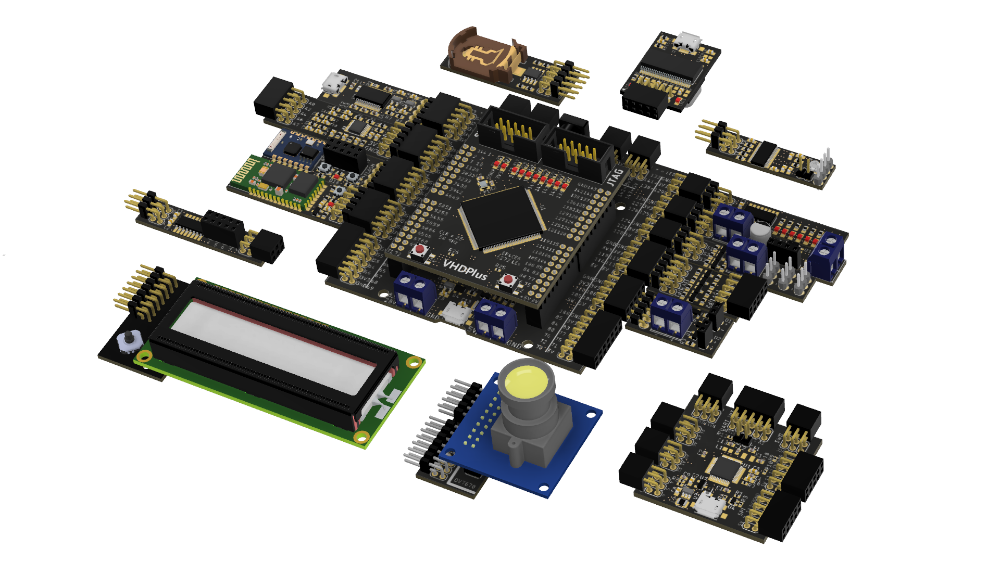

> :warning: _This section is not up to date._

The VHDP Boards feature a plug and play experience together with the [VHDP Shield](/docs/component_vhdpshield) and often have more features than the usual development boards. To make including the boards in your project as easy as possible, they all have documentation, libraries and examples that are included natively in the VHDP IDE.

## Overview
|Name  |Description  |
|--|--|
| [ADC Extension](/docs/extension_adc) | 8 Analog inputs |
| [Bluetooth Extension](/docs/extension_bluetooth) | Bluetooth UART transfer |
| Control Extension | Buttons, LEDs und Joystick |
| [DC Motor Extension](/docs/extension_dcmotor) | Motor driver and connection for encoder |
| [IO Extension](/docs/extension_io) | Extension for more in- and outputs |
| [LED Extension](/docs/extension_led) | Extension to control 8 additional LEDs |
| LCD Extension | 16x2 character LCD display |
| [Level Shifter Extension](/docs/extension_levelshifter) | To connect 5V components to the 3.3V FPGA |
| Microcontroller Extension | Use an arduino microcontroller together with the VHDP extensions |
| Power Switch Extension | To toggle components that draw more current |
| RTC Extension | Real time clock for current time, date and temperature |
| Servo Extension | To control 3 servo motors |
| Shift Register Extension | For expandable outputs |
| Stepper Motor Extension | To drive stepper motors |
| USB Extension | To transfer data via USB |
| [WiFi Extension](/docs/extension_wifi) | Arduino compatible microcontroller with WiFi module |