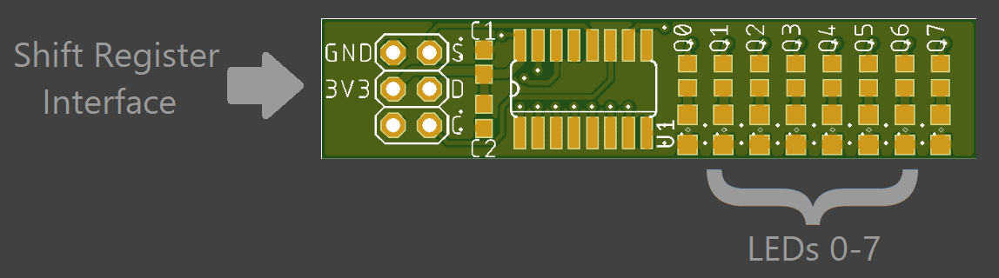

This module has a shift register with LEDs on the outputs to control 8 LEDs with 3 IOs.
## Design


## Implementation
```vhdp
NewComponent LED_Shift_Register 
(
	CLK_Frequency          => 50000000,			--50MHz
	Register_CLK_Frequency => 100000,			--100KHz

	DI_O                   => DI_O,
	CLK_O                  => CLK_O,
	SET_O                  => SET_O,

	DATA                   => LED_Shift_Register_DATA,
);

Process()
{
	Thread
	{
		LED_Shift_Register_DATA <= "01010101";
		Wait(25000000);
		LED_Shift_Register_DATA <= "10101010";
		Wait(25000000);
	}
}
```
