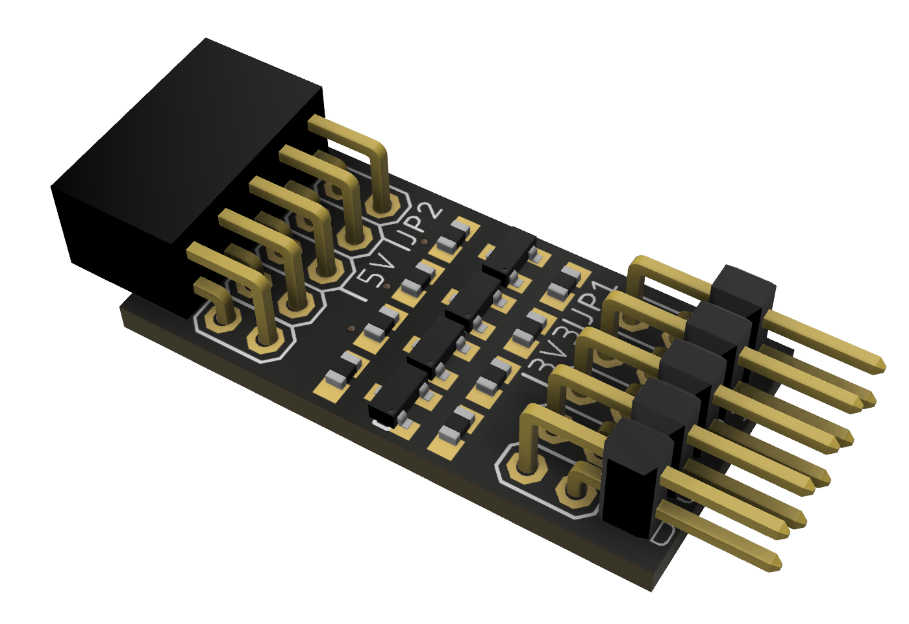
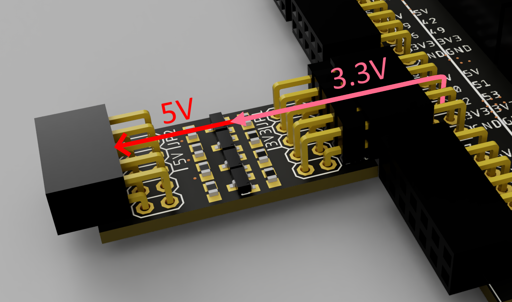

Since the FPGA uses 3.3V for the IOs, which ich more efficient than 5V, you can e.g. directly connect an ESP8266, but you cannot connect a 5V device like an ultrasonic sensor. If you buy electrical components, just look for 3V or 5V in the description to check which voltage is needed.

## Level Shifter Extension

To connect 5V devices without having trouble to convert the signals, just put this level shifter between the Shield and 5V device and use the IOs as before.

Of course all our [extensions](/docs/components_overview) can be connected without a level shifter.
