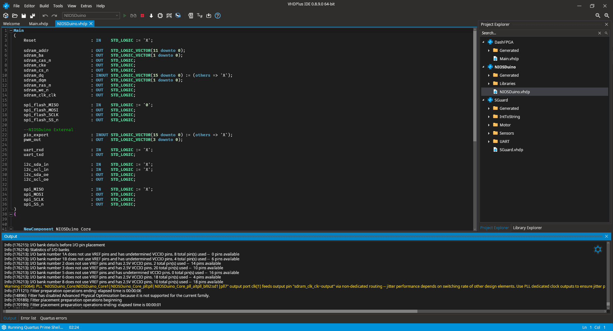

**⚠ THIS DOCUMENTATION IS INCOMPLETE!**

## Prerequisites

### Quartus Prime
To compile code and program your FPGA you will need Quartus Prime.

1. Go to the <a href="http://fpgasoftware.intel.com/18.1/?edition=lite&platform=windows&download_manager=direct" target="_blank">Quartus Prime download page</a> from Intel. 
2. Sign in or create a free account.
3. Download Cyclone IV or Cyclone 10 LP device support depending on your development board.
4. Download the **Quartus Prime Lite** Edition
5. Wait for the downloads to complete and install Quartus Prime using the installer.
6. (Optional) Download and install ModelSim to simulate the created code. You can find a tutorial on how to use ModelSim [here](/docs/getstarted_modelsim).

### VHDP IDE
The VHDP IDE helps to program FPGAs through various features such as programming suggestions and internal vendor-independent libraries that have not been offered by previous programming environments.

VHDP IDE will be available for the following plattforms soon:
|Operating System| 32 Bit | 64 Bit |
|--|--|--|
| Windows | [Download coming soon](#) | [Download coming soon](#) |
| Linux | [Download coming soon](#) | [Download coming soon](#) |



### Download Cable
In order to keep the cost and size of our development boards low, you will need an Altera USB Blaster, 
with which all development boards can be programmed and debugged. 
If you have an USB Blaster, just follow our tutorial on how to install the drivers: [Link coming soon](#)

## First program
Creating a program with the VHDP IDE is simple, but to get you started even faster we've created tutorials and a written instruction:

Create your first program: [Link coming soon](#)
How to use a library: [Link coming soon](#)
Communication with Arduino: [Link coming soon](#)

Manual:
1. Start the VHDP IDE and create a new project (top left). This automatically creates a vhdp file.
2. In the vhdp file, you can program your code. More information about that [here](/docs/getstarted_vhdp). For beginners we recommend to test with this demo code:
```vhdp
/*
Blink example
*/

Main
(
	--I/Os of the FPGA
     LED : OUT STD_LOGIC := '0';  --STD_LOGIC contains states like '1', '0' or 'Z' for High Impedance
)     
{  	
     Process Demo ()
     {
         Thread --Every Thread is an endless loop
         {
             LED <= '1';
             Wait(1000000);
             LED <= '0';
             Wait(1000000);
         }
	}
}
```
3. If no errors appeared while analyzing, you can click on create (6. from the left) and a window will open. Here you can connect the in- and outputs from Main with the IOs of the FPGA (They are labelled on the development board and shield).
Before clicking on OK you should check if the Quartus path is correct. On windows, this path is usually "C:\intelFPGA_lite\18.1\quartus"
4. If an error appeared while compiling, you can double click the error (in front of the line and path) to switch to the file with the error. If you double click again, you get to the line. 
If you found the error, you have to go to the VHDP file to fix.
5. If compiling has finished (can last up to several minutes, because the compiler tries to find the most efficient way to connect the logic elements), you can program the FPGA. To do that, you have to press program (7. from the left), select the connected Programmer and connect the Programmer with the JTAG Connector. Now you can add the programming file (or delete the old and add the new one), select the .pof file if you want to save the file with the internal flash, select Program/Configure and press start.

