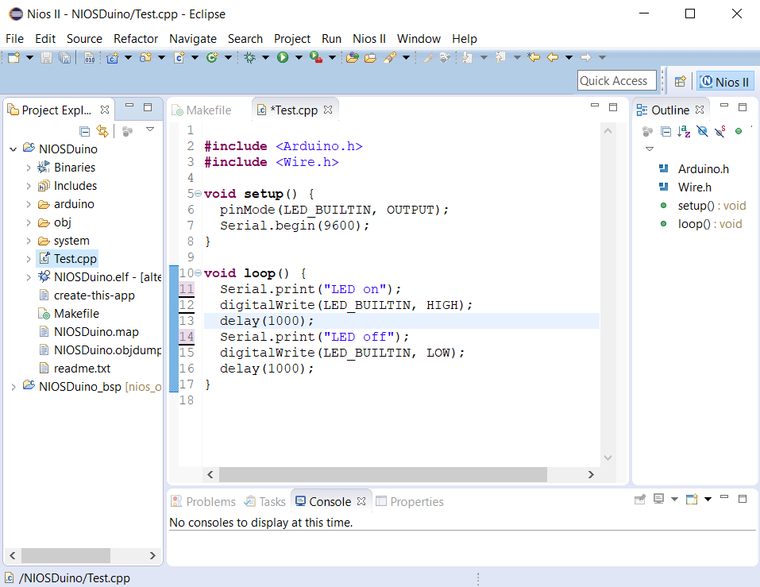

It is possible to design a processor with the logic elements of the FPGA. This is for Intel a Nios II soft core processor. This processor can be configured individually, depending on the periphery needed.
After loading the processor on the FPGA, you can program it with the Nios II Software Build Tools for Eclipse (8. from the left). The processor can be programmed with the JTAG interface and be used like a 32-Bit microcontroller.
Of course you can still use the left over logic elements and RAM together with the processor to combine FPGA and microcontroller. To program the FPGA, the reset input of the processor has to be '1'.

Because this processor can be programmed with c++, people made the Arduino libraries compatible with the Nios II processor.
To make the libraries compatible, you can download the needed libraries and processor (the qsys file) [here](https://github.com/dimag0g/nios_duino).
But the processor needs more RAM than an Arduino. Therefore, we recommend using the external RAM on the Core M.

How to load the processor on the FPGA and program it is shown in this video: Coming soon
