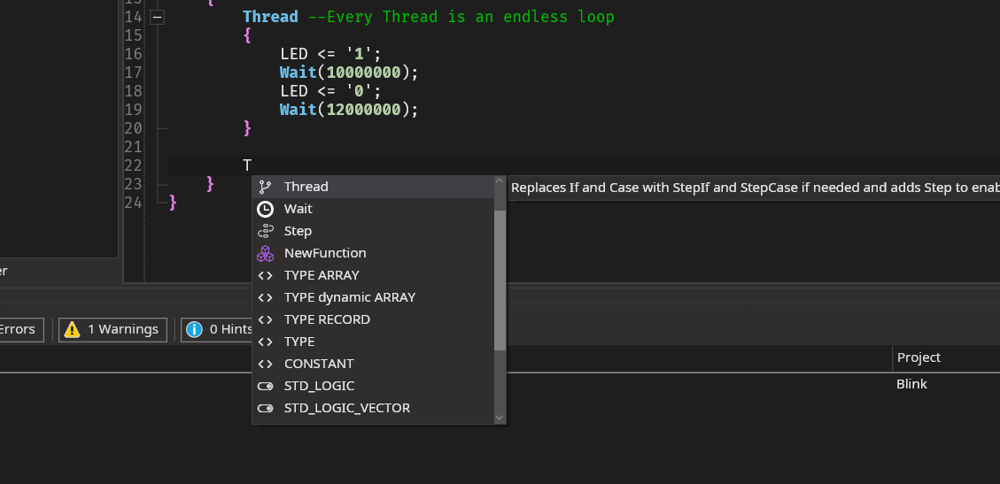

## Description
When you write your VHDP code, the VHDP IDE tries to give suggestions of possible things to add at thisposition in your code. 
For example if you want to set a value, it wouldn't show outputs, because they can't be read. 
But don't worry if the thing you want to write isn't in the list. At the moment the completion can be wrong sometimes.

Press enter to insert the code part or write along to ignore the completion. 
The completion also includes components in your project, so e.g. if you add `NewComponent Frequency_Divider`, the [NewComponent](/docs/vhdp_structuralsyntax_newcomponent) with all I/Os to connect will be inserted.