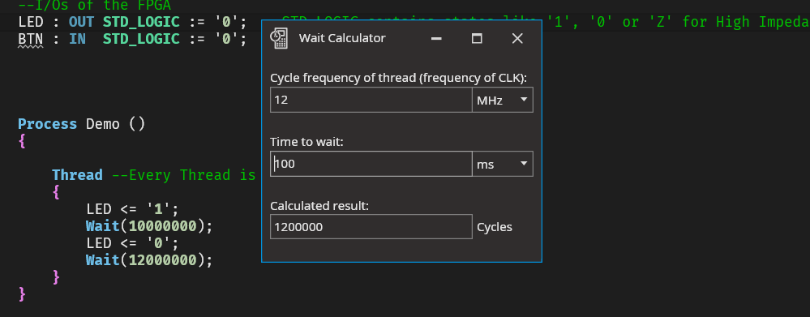

**&#x26A0; We might change the way the wait calculator works until 1.0**

## How to use
1. Enter the frequency of the external oscillator that is connected to CLK
2. Enter the time you want to wait
3. Copy the number of cycles to wait
4. Write e.g. `Wait(6000000);` (If your CLK frequency is 12MHz, you can write e.g. 100ms instead of using the wait calculator)
